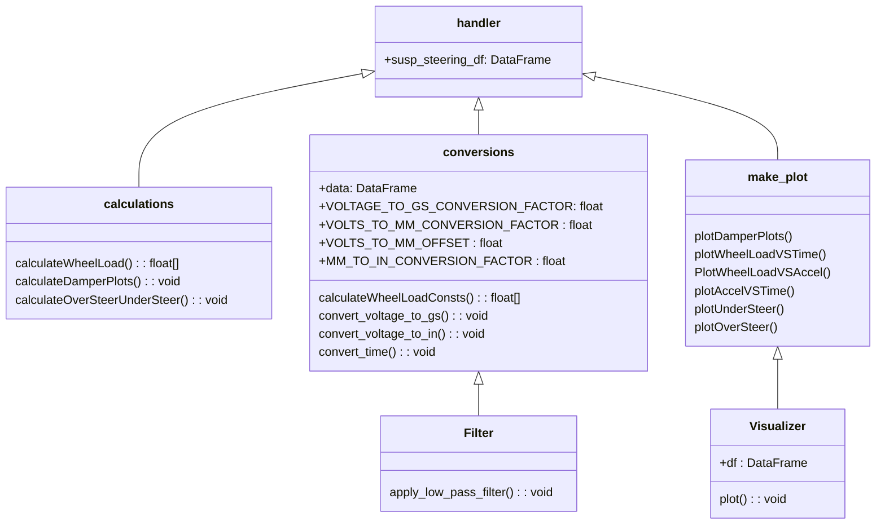

# SuspensionSteeringLib
This repository contains Python scripts developed by Dallas Formula Racing for the purpose of reading sensor data (accelerometers and linear potentiometers) from CSV files, filtering out high-frequency noise, converting the data into displacement and wheel load, and calculating the vehicle's linear and rotational acceleration.

# Sensor Data Sheets
Analog Acel: https://www.analog.com/media/en/technical-documentation/data-sheets/adxl335.pdf

Digital Acel: https://www.adafruit.com/product/4438

Linpot: https://www.pegasusautoracing.com/productselection.asp?Product=MC-206&utm_source=google&utm_medium=cpc&utm_campaign=MC-206&gad_source=1&gclid=Cj0KCQiAy9msBhD0ARIsANbk0A8R3RR0sLIwCP6Y3Wp2lnhvHBwkFSwJzNTXNTJI-pUplBrkuiK3jzgaAv8YEALw_wcB

The vehicle has four linpots, one on each wheel, and two analog accelerometers, one above each axle. The two analog accelerometers are in the process of being replaced for digital ones. 

# File Overview
Datapath: handler.py -> filter.py -> conversions.py -> calculations.py -> plots.py

Filter/filter.py: uses a low pass filter to clean the data of high-frequency noise
Calculations/calculations.py: calculates the vehicle's linear and rotational acceleration
Conversions/conversions.py: based on the sensors' outputs in voltages, calculates the amount of displacement the vehicle experiences and the amount of weight borne by the wheels
Make_plots/plots.py: plots the vehicle's wheel load and acceleration as a function of time
Handler/handler.py: main function of the library

# Current Goal/Future Implementations
- implement the init(), calculate_acceleration_conversion_factors(), and calculate_baseline_accel() functions for the Calculations class in calculations/calculations.py
- implement the init(), convert_to_gs(), convert_voltage_to_mm(), and calculate_wheel_load() functions for the Conversions class in conversions/conversions.py
- implement the init(), plot_acceleration_vs_time(), def_plot_linpot_vs_time(), plot_wheel_load_vs_time(), and plot_acceleration_vs_wheel_load() functions for the Plots class in make_plots/plots.py
- implement the linpot_data_transformation() class in handler.py

# Current UML Diagram / Design

